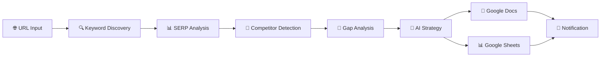

# 🚀 SEO Intelligence Autopilot

**1-Click Website SEO Analysis powered by AI**

Automatically analyze any website's SEO performance, discover competitors, find keyword opportunities, and generate actionable strategies—all from a single URL input.

---

## 🎯 Perfect For

- **Solopreneurs** who need quick SEO insights without the complexity
- **Small Business Owners** who want to understand their online visibility
- **Marketing Agencies** offering SEO audits to clients
- **Content Creators** looking for keyword opportunities

---

## ✨ Key Features

### 🔄 **Fully Automated Analysis**
- Input: Just your website URL
- Output: Complete SEO strategy report in Google Docs + Data in Google Sheets

### 🤖 **AI-Powered Intelligence**
- Uses **Claude Sonnet-4.5** for strategic analysis
- Natural language insights, not just data dumps
- Actionable recommendations tailored to your niche

### 📊 **Real Data, Not Guesses**
- **DataForSEO APIs** provide accurate metrics:
  - Search Volume
  - Keyword Difficulty
  - SERP Positions
  - Competitor Rankings

### 🎭 **Auto-Discovery**
- **Automatic Competitor Detection**: Finds your top competitors in SERPs
- **Keyword Gap Analysis**: Identifies opportunities you're missing
- **SERP Features**: Detects Featured Snippets, People Also Ask, etc.

### 📈 **Google Drive Integration**
- **Google Docs**: Beautifully formatted strategy report
- **Google Sheets**: Detailed keyword database for tracking
- Easy to share with team members or clients

---

## 🏗️ Workflow Architecture



### Workflow Stages:

1. **Input Processing**: Extracts clean domain from URL
2. **Keyword Discovery**: Finds all keywords your site ranks for
3. **SERP Intelligence**: Analyzes top search results for your keywords
4. **Competitor Detection**: Automatically identifies main competitors
5. **Gap Analysis**: Finds keyword opportunities competitors have
6. **AI Strategy**: Claude generates comprehensive recommendations
7. **Output Generation**: Creates formatted reports in Google Drive
8. **Notification**: Sends completion alert via Slack

---

## 📋 What You Get

### 📄 Google Docs Report Includes:

1. **Executive Summary**
   - Current SEO situation overview
   - Biggest opportunity identified

2. **Current Performance Overview**
   - Ranking keywords analysis
   - Key strengths and weaknesses

3. **Competitor Analysis**
   - Who your main competitors are
   - What they're doing well
   - How to differentiate

4. **Top 10 Opportunity Keywords**
   - Quick Win keywords
   - Search volume & difficulty
   - Recommended actions

5. **Content Strategy Recommendations**
   - 3-5 specific content ideas
   - Complete outlines with H2/H3 structure
   - Target keywords and questions to answer

6. **SERP Features Strategy**
   - Featured Snippets opportunities
   - People Also Ask integration

7. **Action Checklist**
   - Prioritized, concrete next steps
   - Non-technical, easy to execute

8. **Estimated Impact**
   - Projected traffic increase
   - Realistic timeline

### 📊 Google Sheets Database Includes:

- **Current Rankings**: All your ranking keywords
- **Opportunities**: Keyword gaps sorted by priority
- **Competitors**: Comparison with competitor rankings
- **Tracking**: Historical performance data

---

## 🔧 Setup Requirements

### 1. **n8n Instance**
- Cloud or self-hosted n8n (v1.0+)

### 2. **API Credentials Needed**

#### DataForSEO API
- Sign up at [DataForSEO](https://dataforseo.com/)
- Pricing: ~$0.60 per analysis
- Recommended plan: Pay-as-you-go or Starter

#### Anthropic Claude API
- Get API key from [Anthropic Console](https://console.anthropic.com/)
- Model used: Claude Sonnet-4.5
- Pricing: ~$0.20 per analysis

#### Google APIs
- Enable Google Docs API
- Enable Google Sheets API
- Set up OAuth2 credentials

#### Slack (Optional)
- Create Slack App for notifications
- Get Bot Token

### 3. **Total Cost Per Analysis**
```
DataForSEO:  ~$0.60
Claude:      ~$0.20
-----------------------
Total:       ~$0.80 per website analyzed

Compared to manual analysis:
- Time saved: 2-3 hours
- Human cost equivalent: $100-300
- ROI: 99% cost reduction!
```

---

## 📥 Installation

### Step 1: Import Workflow

1. Open your n8n instance
2. Go to **Workflows** → **Import from File**
3. Select `SEO_Intelligence_Autopilot.json`
4. Click **Import**

### Step 2: Configure Credentials

#### DataForSEO Credentials
1. Click on any DataForSEO HTTP Request node
2. Create new credential: **Basic Auth**
3. Username: Your DataForSEO login
4. Password: Your DataForSEO password

#### Anthropic Claude Credentials
1. Click on the "Claude: Strategic Analysis" node
2. Create new credential: **Anthropic API**
3. Enter your API key

#### Google Docs Credentials
1. Click on "Google Docs: Create Report" node
2. Create new credential: **Google Docs OAuth2**
3. Follow OAuth flow

#### Google Sheets Credentials
1. Click on "Google Sheets: Update Tracker" node
2. Create new credential: **Google Sheets OAuth2**
3. Follow OAuth flow

#### Slack Credentials (Optional)
1. Click on "Slack: Completion Notification" node
2. Create new credential: **Slack API**
3. Enter Bot Token
4. Select your notification channel

### Step 3: Configure Google Sheets Tracker

**Option A: Create New Tracker Spreadsheet**

1. Create a new Google Sheet named "SEO Intelligence Tracker"
2. Add these sheet tabs:
   - "Current Rankings"
   - "Opportunities"
   - "Competitors"
   - "Tracking"
3. Copy the Spreadsheet ID from the URL
4. Paste it in the "Google Sheets: Update Tracker" node

**Option B: Let Workflow Create It (Advanced)**

Modify the Google Sheets node to create a new spreadsheet on first run.

### Step 4: Activate Workflow

1. Click **Active** toggle at top-right
2. Copy the **Webhook URL**
3. You're ready to go! 🎉

---

## 🎬 Usage

### Method 1: Direct Webhook Call

```bash
curl -X POST https://your-n8n-instance.com/webhook/seo-autopilot \
  -H "Content-Type: application/json" \
  -d '{"url": "https://hyroxtrainingplans.com"}'
```

### Method 2: Simple HTML Form

Create a simple form to trigger analysis:

```html
<!DOCTYPE html>
<html>
<head>
    <title>SEO Autopilot</title>
</head>
<body>
    <h1>🚀 SEO Intelligence Autopilot</h1>
    <form action="https://your-n8n-instance.com/webhook/seo-autopilot" method="POST">
        <label>Website URL:</label>
        <input type="url" name="url" placeholder="https://example.com" required>
        <button type="submit">Analyze My Site 🔍</button>
    </form>
</body>
</html>
```

### Method 3: Integrate with Make/Zapier

Trigger the webhook from other automation tools when:
- New client signs up
- Weekly scheduled analysis
- On-demand via Slack command

---

## 📊 Example Analysis

### Test Domain: `hyroxtrainingplans.com`

**What the workflow will discover:**

1. **Current Keywords**: All keywords the site ranks for
   - Example: "hyrox training", "hyrox workouts", etc.

2. **Auto-Detected Competitors**:
   - CompetitorX.com (appears in 80% of SERPs)
   - CompetitorY.com (appears in 60% of SERPs)

3. **Keyword Gaps**: Opportunities found
   - "hyrox training plan PDF" (2,400 volume, competitor ranks #3, you don't rank)
   - "hyrox nutrition guide" (880 volume, low difficulty)

4. **SERP Features**:
   - Featured Snippets on "what is hyrox training"
   - People Also Ask: "How long to train for Hyrox?"

5. **AI Strategy**: Claude generates actionable plan
   - Priority 1: Create "Complete Hyrox Training Plan PDF Guide"
   - Priority 2: Optimize homepage for "hyrox training plans"
   - Priority 3: Add FAQ section for PAA questions

---

## 🎛️ Customization Options

### Adjust Analysis Depth

**Current Settings** (in HTTP Request nodes):

```javascript
// Keywords For Site
"limit": 50  // Increase to 100 for more keywords
"filters": [
  ["search_volume", ">", 10],  // Increase to 50+ for higher quality
  ["rank_group", "<=", 20]  // Change to 10 for top 10 only
]

// SERP Analysis
"depth": 10  // Increase to 20 or 100 for more competitor data
```

### Change Location/Language

Default: United States, English

```javascript
// Modify in all DataForSEO nodes:
"location_code": 2840,  // USA (see DataForSEO location codes)
"language_code": "en"   // English
```

Common location codes:
- 2840: United States
- 2826: United Kingdom
- 2276: Germany
- 2250: France
- 2724: Spain

### Customize Claude Analysis

Edit the prompt in "Prepare Analysis Prompt" node:
- Add industry-specific guidelines
- Request different report formats
- Include competitor-specific questions
- Adjust tone and detail level

### Add More Competitor Data

Currently analyzes **Top 1 Competitor** in depth.

To analyze more:
1. Duplicate "DataForSEO: Competitor Keywords" node
2. Change to `$json.competitors_found[1].domain` for 2nd competitor
3. Merge additional data in the final merge node

---

## 🚨 Troubleshooting

### "No keywords found"
- **Cause**: Domain is new or not ranking yet
- **Solution**: Try adding `www.` or checking correct domain
- **Alternative**: Manually input competitor URLs

### "API Authentication Failed"
- **Cause**: Invalid DataForSEO credentials
- **Solution**: Verify login/password in credential settings
- **Check**: Account has credits available

### "Claude response too long"
- **Cause**: Too much data for single analysis
- **Solution**: Reduce keyword limits in DataForSEO calls
- **Alternative**: Split into multiple analyses

### "Google Docs creation failed"
- **Cause**: OAuth token expired
- **Solution**: Re-authenticate Google Docs credential
- **Check**: Docs API is enabled in Google Cloud

### "Competitor detection returns no results"
- **Cause**: Very niche market or new domain
- **Solution**: Check SERP data manually
- **Alternative**: Manually specify competitors in code node

---

## 📈 Advanced Features (Future Roadmap)

### Coming Soon:
- [ ] **Backlink Analysis**: Discover link-building opportunities
- [ ] **Content Length Analysis**: Optimal word count recommendations
- [ ] **Historical Tracking**: Month-over-month performance
- [ ] **Automated Scheduling**: Weekly/monthly analysis
- [ ] **Multi-language Support**: Automatic language detection
- [ ] **PDF Export**: Client-ready PDF reports
- [ ] **White-label Options**: Custom branding
- [ ] **Notion Integration**: Export to Notion databases

---

## 💰 Cost Optimization Tips

### Reduce API Costs:

1. **Limit keyword scope**
   - Reduce from 50 to 30 keywords
   - Saves: ~20% on DataForSEO costs

2. **Skip competitor analysis for quick audits**
   - Disable "Competitor Keywords" node
   - Saves: ~$0.15 per run

3. **Cache results**
   - Store in Google Sheets
   - Re-run only monthly
   - Saves: 95% costs for repeat analyses

4. **Use Claude Haiku for simple reports**
   - Switch from Sonnet-4.5 to Haiku
   - Saves: ~$0.15 per run
   - Trade-off: Slightly less detailed analysis

---

## 🔒 Security & Privacy

### Data Handling:
- ✅ All data processed in your n8n instance
- ✅ No third-party storage (except Google Drive)
- ✅ API credentials stored securely in n8n
- ✅ Webhook can be password-protected

### Recommendations:
- Use environment variables for sensitive data
- Enable n8n authentication
- Restrict webhook to specific IPs if self-hosted
- Regularly rotate API keys

---

## 📚 Resources

### Documentation:
- [DataForSEO API Docs](https://docs.dataforseo.com/v3/)
- [Anthropic Claude API](https://docs.anthropic.com/claude/reference/)
- [n8n Documentation](https://docs.n8n.io/)

### Support:
- [DataForSEO Support](https://dataforseo.com/contact)
- [n8n Community Forum](https://community.n8n.io/)

### Pricing:
- [DataForSEO Pricing](https://dataforseo.com/pricing)
- [Anthropic Pricing](https://www.anthropic.com/pricing)

---

## 🤝 Contributing

Have ideas to improve this workflow?

- Fork and submit PRs
- Open issues for bugs
- Share your custom modifications

---

## 📜 License

MIT License - Feel free to use, modify, and distribute.

---

## 🎉 Credits

**Created by:** [Your Name]
**Inspired by:** The need for simple, powerful SEO tools for solopreneurs
**Powered by:**
- n8n (Workflow Automation)
- DataForSEO (SEO Data)
- Anthropic Claude (AI Analysis)
- Google Workspace (Output)

---

## 🔥 Pro Tips

### For Agencies:
1. Create a client-facing form for URL submission
2. Set up dedicated Google Drive folder per client
3. Schedule monthly automated analysis
4. Use results to justify retainers

### For Solopreneurs:
1. Run analysis before creating new content
2. Track keyword improvements monthly
3. Focus on "Quick Win" recommendations first
4. Share results with VA or content team

### For SEO Enthusiasts:
1. Compare multiple competitors at once
2. Create custom SERP feature strategies
3. Build keyword clusters for topic authority
4. Export data for advanced tools like Ahrefs/Semrush

---

**Ready to get started?** Import the workflow and analyze your first site! 🚀

Questions? Issues? Feedback? Open an issue or reach out!
