# 📊 SEO Intelligence Autopilot - Workflow Diagrams

## 🎯 Overview: High-Level Flow

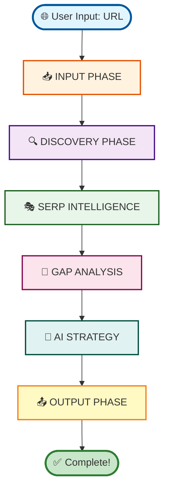

---

## 🔄 Detailed Node-Level Flow

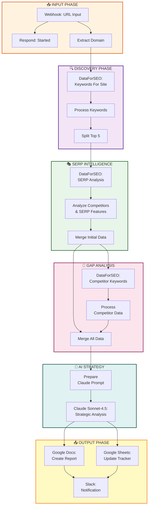

---

## 📊 Data Flow Diagram

```mermaid
graph LR
    subgraph INPUT_DATA["INPUT DATA"]
        URL[🌐 Website URL<br/>hyroxtrainingplans.com]
    end

    subgraph EXTRACTED["EXTRACTED DATA"]
        DOM[Domain: hyroxtrainingplans.com]
    end

    subgraph KEYWORD_DATA["KEYWORD DISCOVERY"]
        KW[50 Keywords Found:<br/>• hyrox training<br/>• hyrox workouts<br/>• Position: 3-15<br/>• Volume: 100-5000]
    end

    subgraph SERP_DATA["SERP ANALYSIS"]
        TOP5[Top 5 Keywords<br/>analyzed in SERP]
        COMP[Competitors Found:<br/>• competitor1.com<br/>• competitor2.com<br/>• competitor3.com]
        FEAT[SERP Features:<br/>• Featured Snippets<br/>• People Also Ask<br/>• Related Searches]
    end

    subgraph GAP_DATA["GAP ANALYSIS"]
        CGAP[Competitor Keywords:<br/>30 keywords they rank for]
        GAPS[Keyword Gaps Found:<br/>15 opportunities<br/>we don't rank for]
    end

    subgraph AI_DATA["AI PROCESSING"]
        PROMPT[Comprehensive Prompt<br/>with all data]
        STRAT[Strategic Analysis:<br/>• Opportunities<br/>• Content Ideas<br/>• Action Plan]
    end

    subgraph OUTPUT_DATA["OUTPUT"]
        DOC[📄 Google Doc:<br/>SEO Strategy Report]
        SHEET[📊 Google Sheet:<br/>Keyword Tracker]
        NOTIF[📧 Slack Notification]
    end

    URL --> DOM
    DOM --> KW
    KW --> TOP5
    TOP5 --> COMP
    TOP5 --> FEAT
    COMP --> CGAP
    CGAP --> GAPS
    KW --> PROMPT
    COMP --> PROMPT
    GAPS --> PROMPT
    FEAT --> PROMPT
    PROMPT --> STRAT
    STRAT --> DOC
    STRAT --> SHEET
    DOC --> NOTIF
    SHEET --> NOTIF

    style INPUT_DATA fill:#e1f5ff,stroke:#01579b,stroke-width:2px
    style EXTRACTED fill:#fff3e0,stroke:#e65100,stroke-width:2px
    style KEYWORD_DATA fill:#f3e5f5,stroke:#4a148c,stroke-width:2px
    style SERP_DATA fill:#e8f5e9,stroke:#1b5e20,stroke-width:2px
    style GAP_DATA fill:#fce4ec,stroke:#880e4f,stroke-width:2px
    style AI_DATA fill:#e0f2f1,stroke:#004d40,stroke-width:2px
    style OUTPUT_DATA fill:#fff9c4,stroke:#f57f17,stroke-width:2px
```

---

## 🔀 Parallel Processing Flow

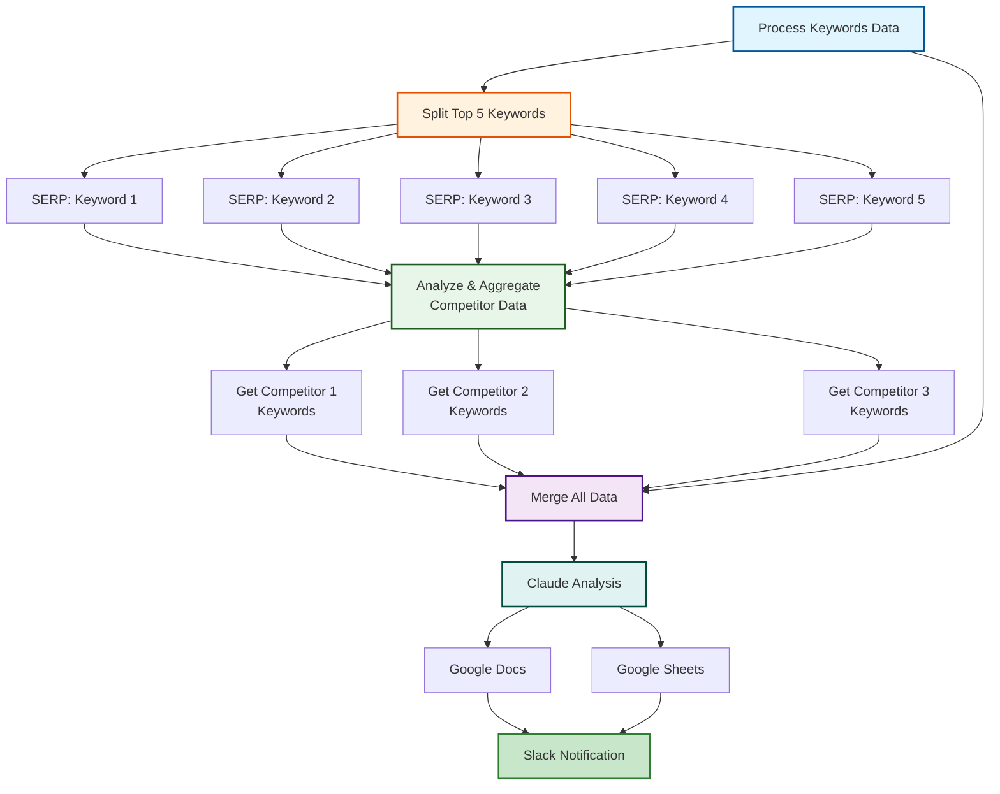

---

## 🎯 API Integration Flow

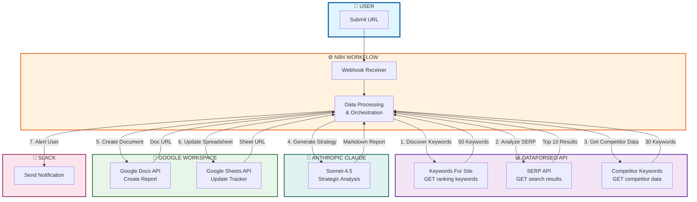

---

## 🔄 Decision Flow: Competitor Discovery Logic

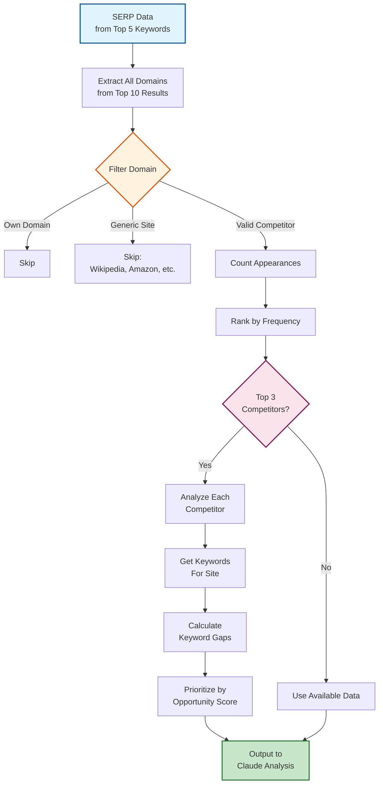

---

## 📈 Example: Real Execution Flow for hyroxtrainingplans.com

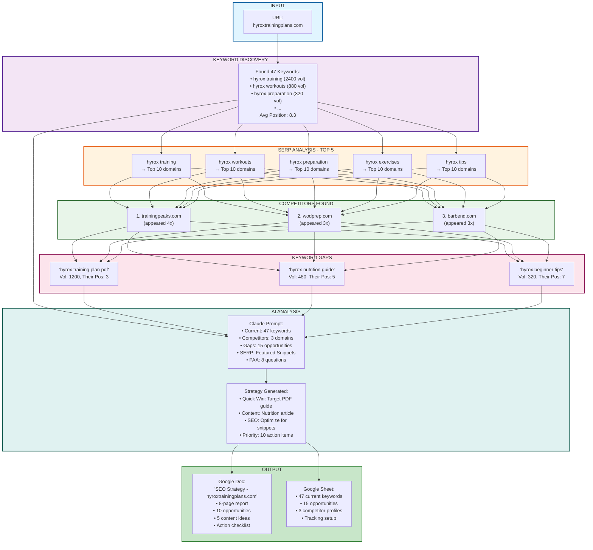

---

## ⏱️ Timing Diagram

```mermaid
gantt
    title SEO Intelligence Autopilot - Execution Timeline
    dateFormat  ss
    axisFormat %S sec

    section Input
    Webhook Receive           :done, 00, 1s
    Extract Domain            :done, 01, 1s

    section Discovery
    Keywords For Site API     :active, 02, 8s
    Process Keywords          :active, 10, 2s
    Split Top 5               :active, 12, 1s

    section SERP
    SERP Analysis (5 calls)   :crit, 13, 15s
    Analyze Competitors       :crit, 28, 3s

    section Gaps
    Competitor Keywords (3x)  :31, 12s
    Process Gap Data          :43, 2s
    Merge All                 :45, 1s

    section AI
    Prepare Prompt            :46, 1s
    Claude Analysis           :crit, 47, 25s

    section Output
    Create Google Doc         :72, 5s
    Update Google Sheet       :72, 3s
    Send Notification         :77, 2s

    section Complete
    Done                      :milestone, 79, 0s
```

**Total Time: ~80 seconds (1:20 minutes)**

---

## 🔀 Error Handling Flow (Future Enhancement)

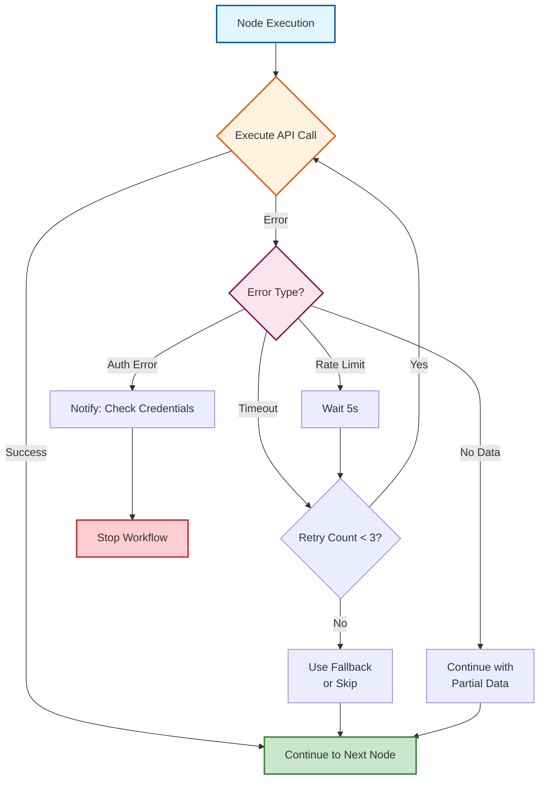

---

## 📊 Data Volume Visualization

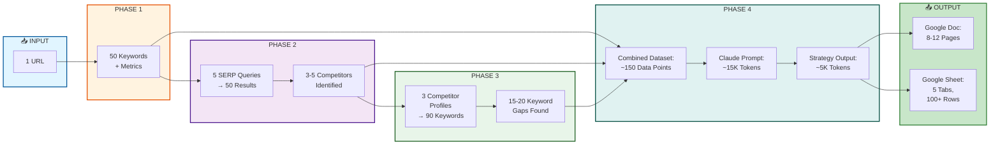

---

## 🎯 n8n Canvas Layout

```mermaid
graph LR
    subgraph COL1["Column 1<br/>INPUT"]
        N1[Webhook]
        N2[Respond]
        N3[Extract]
    end

    subgraph COL2["Column 2<br/>DISCOVERY"]
        N4[Keywords API]
        N5[Process]
        N6[Split]
    end

    subgraph COL3["Column 3<br/>SERP"]
        N7[SERP API]
        N8[Analyze]
        N9[Merge]
    end

    subgraph COL4["Column 4<br/>GAPS"]
        N10[Comp API]
        N11[Process]
        N12[Merge All]
    end

    subgraph COL5["Column 5<br/>AI"]
        N13[Prepare]
        N14[Claude]
    end

    subgraph COL6["Column 6<br/>OUTPUT"]
        N15[Docs]
        N16[Sheets]
        N17[Slack]
    end

    N1 --> N2
    N1 --> N3
    N3 --> N4
    N4 --> N5
    N5 --> N6
    N6 --> N7
    N7 --> N8
    N8 --> N9
    N9 --> N10
    N9 --> N12
    N10 --> N11
    N11 --> N12
    N12 --> N13
    N13 --> N14
    N14 --> N15
    N14 --> N16
    N15 --> N17
    N16 --> N17

    style COL1 fill:#e1f5ff,stroke:#01579b,stroke-width:2px
    style COL2 fill:#fff3e0,stroke:#e65100,stroke-width:2px
    style COL3 fill:#f3e5f5,stroke:#4a148c,stroke-width:2px
    style COL4 fill:#e8f5e9,stroke:#1b5e20,stroke-width:2px
    style COL5 fill:#e0f2f1,stroke:#004d40,stroke-width:2px
    style COL6 fill:#c8e6c9,stroke:#2e7d32,stroke-width:2px
```

---

## 🎨 Color Coding Guide

| Phase | Color | Purpose |
|-------|-------|---------|
| 🌐 **Input** | Blue | User interaction & webhook |
| 🔍 **Discovery** | Orange | Keyword discovery via API |
| 🎭 **SERP** | Purple | Search result analysis |
| 💎 **Gaps** | Green | Competitor & gap analysis |
| 🧠 **AI** | Teal | Claude AI processing |
| 📤 **Output** | Yellow | Final report generation |
| ✅ **Complete** | Light Green | Success state |
| ❌ **Error** | Red | Error states |

---

## 📱 Mobile-Friendly Summary Flow

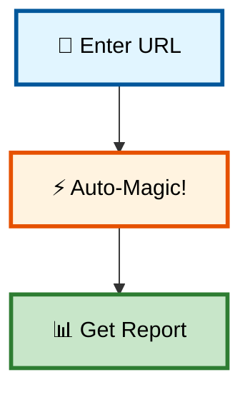

**For Solopreneurs:** It's literally this simple! 🚀
